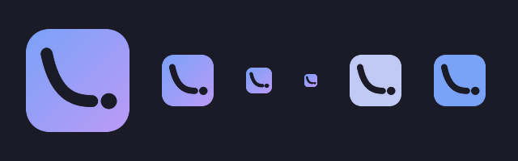

# Фирменный стиль

Знак — плитка с вырезанной кривой потерь: крутой спад, плато и отдельная точка
в конце. Точка — лучший чекпоинт, ради которого запуск и затевался, и именно
его `xrun pull --ckpt best` в итоге забирает. Отрыв точки от кривой обязателен:
слитая с линией, она читается как загнутый хвост, и знак превращается в букву
«L».

Кривая вырезана, а не нарисована поверх: под ней обязан быть фон. На тёмной
подложке TUI нарисованная белым кривая была бы закорючкой на квадрате, а
вырез остаётся знаком на любом фоне.

Поле 100×100, углы 22, толщина кривой 11, точка радиусом 7.5 в (80, 70).

Меньше 16 px знак не ставится: кривая слипается с точкой.

## Палитра

Палитра одна на всё — та же Tokyo Night, что у TUI по умолчанию
(`python/xrun_tui/src/xrun_tui/app.tcss`). Сайт, README и терминал поэтому не
расходятся.

| | | |
| --- | --- | --- |
| `#1A1B26` | фон | TUI, сайт, подписи бейджей в README |
| `#24283B` | поверхность | карточки, шапка TUI |
| `#C0CAF5` | текст | имя в лого-строке |
| `#565F89` | приглушённый | подписи, выключено |
| `#7AA2F7` → `#BB9AF7` | диагональ бренда | заливка знака, акцентная полоса |

Состояния — те же цвета, что у статусов запусков в TUI
(`STATUS_DOT` в `python/xrun_tui/src/xrun_tui/utils.py`):

| | |
| --- | --- |
| `#E0AF68` | provisioning, uploading — инстанс готовится, счёт уже идёт |
| `#9ECE6A` | running — поллер ведёт запуск |
| `#565F89` | done — всё кончилось, инстанс погашен, внимания не нужно |
| `#F7768E` | failed — упало, нужен человек |
| `#BB9AF7` | cancelled — остановлен руками |

Законченный запуск серый, а не зелёный, и это не вкусовщина: зелёным в списке
горит то, что прямо сейчас тратит деньги, а завершённое уходит в фон. Красный
остаётся ровно на одно — сломалось и нужен человек.

## Лого-строка

Знак, отступ в четверть высоты, имя строчными: `xrun`. Всегда одним словом,
без заглавной — ни «XRun», ни «X-Run», ни капсом.

## Нельзя

- Точку сливать с кривой или убирать — остаётся «L».
- Кривую рисовать поверх плитки вместо выреза.
- Растущую кривую вместо падающей: это loss, а не выручка.
- Тень, обводку, свечение вокруг знака.
- Другие градиенты, кроме диагонали бренда.

## Где это живёт

Знак нарисован дважды: `scripts/brand.py` собирает PNG для README и сайта
(`docs/brand/mark.png`, `docs/brand/sizes.png`, `docs/favicon.png`,
`docs/og.png`), SVG в `docs/index.html` — контур для самого сайта. Геометрия у
них одна; правите одно — правьте и другое.

Пересобрать картинки: `python scripts/brand.py` (нужен Pillow).
